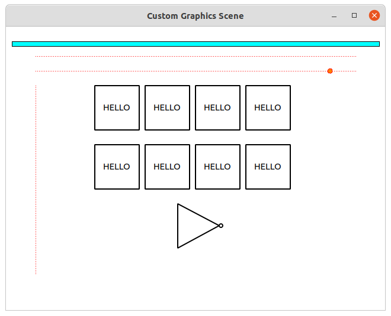

# Graphics Scene Version 1
Custom QWidget based Graphics Scene Library

You can:
- Add and remove elements
- Select and unselect elements
- Movable and non-movable elements
- Set z values of elements
- Events:
  - onEnter
  - onLeave
  - mousePress
  - mouseRelease
  - mouseClick events

